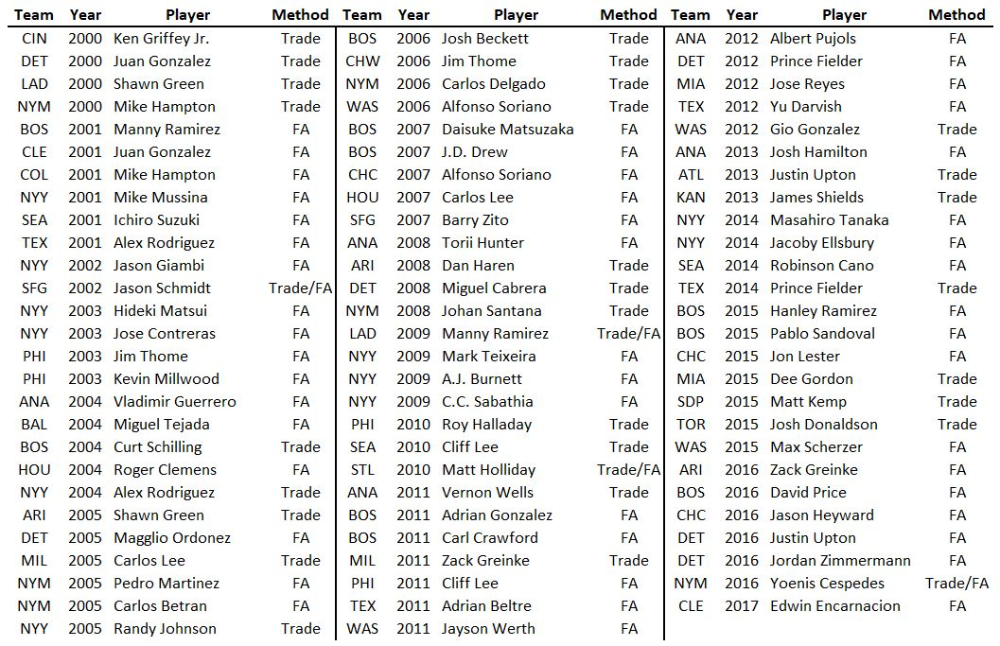
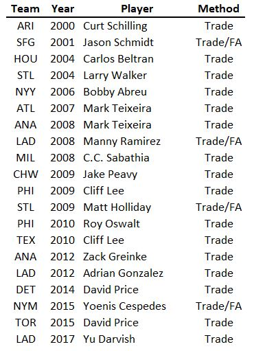
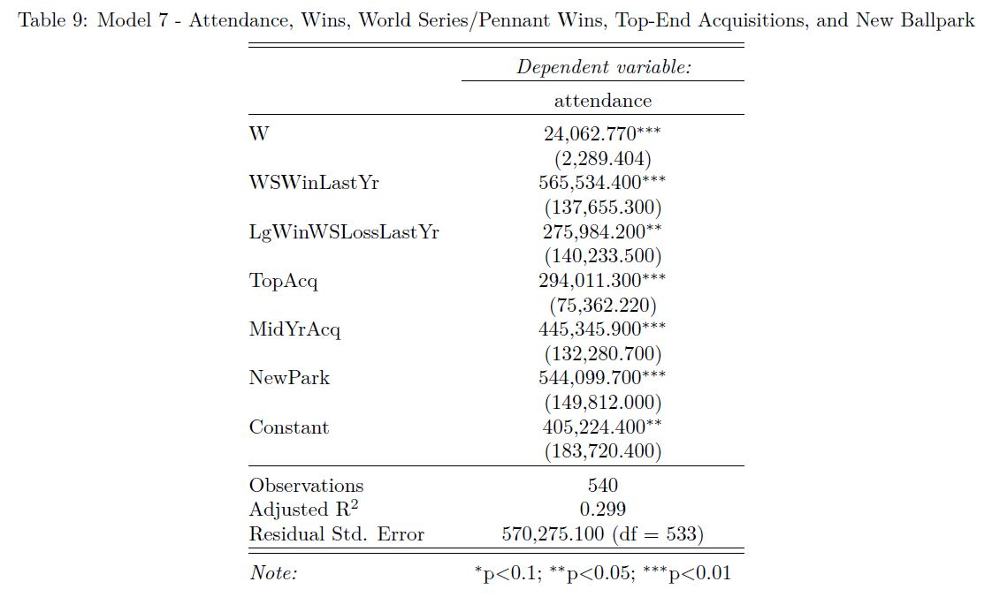

# A Study of Baseball Attendance: the Effects of Winning and Top-End Player Acquisitions
This is a statistical examination of one of the factors most critical to measuring a major league team’s success: attendance, the most direct driver of a team’s revenue. In my analysis, I sought to answer several questions.
The first two were fairly obvious:

1. What is the relationship between team wins and attendance?
2. How does winning a league pennant or World Series relate to attendance?

The deeper, more intriguing questions I wanted to address were related to payroll and high-end player acquisitions:

3. Is there a relationship between payroll and attendance?
4. How does a top-end player acquisition relate to attendance?

I chose to look at the years 2000-2017, as that 18-year period would allow for an adequate number of data points (540), while covering the period containing all modern mega-contracts. 

**Note: This is strictly an observational study, so the results cannot be construed as causal relationships.**

**Methodology**
I performed my analyses in R, using linear regression models. My starting point for data was the Teams table from the 2017 version of the Lahman database (available at seanlahman.com, copyright 1996-2018 by Sean Lahman). I added six additional variables to the dataset: 

* Payroll: I used Opening Day payroll figures from Cot’s Baseball Contracts, adjusted to 2017 equivalent amounts using a calculator based on the consumer price indices for the years in question.
* WSWinLastYr: An indicator variable to show whether a team won the World Series in the preceding year.
* LgWinWSLossLastYr: An indicator variable showing whether a team won the pennant, but lost the World Series in the preceding year.
* NewPark: An indicator variable showing whether a team opened a new ballpark in a given season. 
* TopAcq: An indicator variable showing whether a team made a top-end player acquisition, via free agency or trade, in the off-season prior to the season in question. I manually compiled this list, and there is some subjectivity to it. My definition of a top-end player acquisition is one involving a superstar or one with a very high dollar value. This variable does not consider how these acquisitions played out, but rather, how they would have been viewed at the time. Below is the complete list of those considered top acquisitions. 

  

* MidAcq: An indicator variable showing whether a team made a top-end player acquisition during a given season. This is equally subjective. In the event that a team traded for a free agent-to-be, and the acquiring team then re-signed that player in the subsequent off-season, I treated it as both a mid-season acquisition and a new free agent signing. In most of these cases, the fans (and the team) did not expect to re-sign the player. Below is the complete list of top-end mid-season acquisitions. “Trade/FA” denotes the player was acquired via trade and then resigned.

  

**Results: Final Model**

  

In the final model, we can see strong associations between all newly added variables and attendance. Individual wins, pennant or World Series wins in the preceding season, and opening a new ballpark all accompany expected attendance bumps. Winning is the goal of every team, but it cannot be rigidly controlled by management. Player acquisitions can. The model shows highly statistically significant relationships between both off-season and mid-season top-end free agent acquisitions and attendance (an annual attendance bump of 294,011 and 445,346, respectively). This is before factoring in wins, which have their own positive relationship with attendance. If we assume a top end free agent results in an additional five wins for a team, the associated increase in attendance would be over 400,000, which would amount to more than $13 million in ticket revenue in the first year (using a major league average ticket price of $32). This is before accounting for concessions, merchandise, and, with any luck, playoff appearances.

